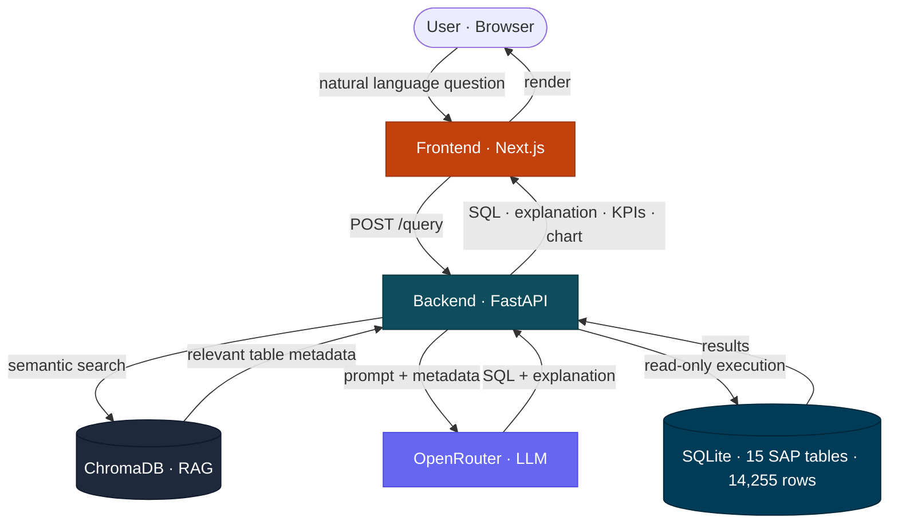

<div align="center">


<br /><br />

**Translate business questions into executable SQL over SAP data, powered by LLMs and RAG.**

<br />

[](https://www.python.org/)
[](https://fastapi.tiangolo.com/)
[](https://nextjs.org/)
[](https://tailwindcss.com/)

[](https://www.trychroma.com/)
[](https://www.sqlite.org/)
[](https://openrouter.ai/)

</div>

---

DataSpeak takes a natural language question in Portuguese (e.g. *"Qual o faturamento total por cliente em 2025?"*), retrieves relevant SAP table metadata via RAG, generates a SQL query through an LLM, executes it against a simulated database, and returns the results with a plain-language explanation, all in a single request.

The system was evaluated across three commercial LLMs (Claude Sonnet 4.5, GPT-4o, Gemini 2.0 Flash) using a 50-case multilevel benchmark, achieving up to **60% execution accuracy** with a manual quality score of **9.1/10**.

<div align="center">

`Natural Language` → `RAG Retrieval` → `LLM Generation` → `SQL Execution` → `Visualization`

</div>

---

## Table of Contents

- [Architecture](#architecture)
- [Tech Stack](#tech-stack)
- [Repository Structure](#repository-structure)
- [Environment Variables](#environment-variables)
- [Getting Started](#getting-started)
- [Usage](#usage)
- [SAP Catalog](#sap-catalog)
- [API Reference](#api-reference)
- [Evaluation](#evaluation)
- [Running Tests](#running-tests)
- [License](#license)

---

## Architecture



**Flow:** the user's question reaches the backend, which retrieves relevant table metadata from ChromaDB, assembles a prompt, and sends it to the LLM via OpenRouter. The generated SQL is executed read-only against the SQLite database, and the frontend renders the SQL, explanation, KPIs, and chart.

---

## Tech Stack

| Layer | Technology | Purpose |
|---|---|---|
| **Frontend** | Next.js 16, React, Tailwind CSS v4, Framer Motion, Sonner | UI, visualization, toast notifications |
| **Backend** | Python 3.12, FastAPI, Pydantic | API orchestration, validation, query execution |
| **RAG** | ChromaDB, `paraphrase-multilingual-MiniLM-L12-v2` | Semantic retrieval of SAP metadata in Portuguese |
| **LLM** | OpenRouter — Claude Sonnet 4.5 · GPT-4o · Gemini 2.0 Flash | SQL generation and natural language explanation |
| **Database** | SQLite (read-only mode) | Simulated SAP environment with realistic Brazilian data |

---

## Repository Structure

```
dataspeak/
├── backend/
│   ├── app/
│   │   ├── main.py                  # FastAPI app — /query and /health endpoints
│   │   └── ai_engine/
│   │       ├── indexer.py            # Populates ChromaDB from YAML catalog
│   │       ├── retriever.py          # Semantic search over SAP table metadata
│   │       └── generator.py          # Prompt construction + OpenRouter call
│   ├── catalog/
│   │   └── sap_catalog.yaml          # Curated metadata for 15 SAP tables
│   ├── db/
│   │   ├── schema.sql                # DDL for all tables (mirrors SAP structure)
│   │   ├── seed.py                   # Deterministic data generator (seed=42)
│   │   └── sqlite_executor.py        # Read-only execution with safety layers
│   ├── tests/
│   │   ├── eval_dataset.json         # Gold standard — 50 test cases
│   │   ├── eval_runner.py            # Multi-model evaluation runner
│   │   └── results/                  # CSV outputs and comparison reports
│   ├── data/                         # Generated DB + ChromaDB (gitignored)
│   ├── requirements.txt
│   └── .env.example
├── frontend/
│   ├── src/
│   │   ├── app/                      # Next.js app router
│   │   ├── components/               # Layout, dashboard, analysis views
│   │   ├── hooks/                    # useAnalysis — API integration
│   │   └── styles/                   # Tailwind v4 semantic tokens
│   ├── public/                       # Logo, favicon
│   ├── package.json
│   └── .env.local.example
└── README.md
```

---

## Environment Variables

Copy the example files and fill in your values:

```bash
cp backend/.env.example backend/.env
cp frontend/.env.local.example frontend/.env.local
```

| Variable | Required | Default | Description |
|---|:---:|---|---|
| `OPENROUTER_API_KEY` | Yes | — | API key from [openrouter.ai](https://openrouter.ai) |
| `DEFAULT_MODEL` | — | `anthropic/claude-sonnet-4-5` | LLM model slug for SQL generation |
| `DATABASE_PATH` | — | `data/dataspeak.db` | Path to the SQLite database |
| `NEXT_PUBLIC_API_URL` | Yes | — | Backend URL (e.g. `http://localhost:8000`) |

---

## Getting Started

### Prerequisites


You'll also need **Git** and an [OpenRouter](https://openrouter.ai) API key.

### Backend

```bash
cd backend
python -m venv venv

# Linux/macOS
source venv/bin/activate
# Windows (PowerShell)
.\venv\Scripts\Activate.ps1

pip install -r requirements.txt
```

Generate the simulated database (14,255 rows, deterministic):

```bash
python -m db.seed
```

Index the SAP catalog into ChromaDB:

```bash
python -m app.ai_engine.indexer
```

### Frontend

```bash
cd frontend
npm install
```

---

## Usage

Start the backend:

```bash
cd backend
python -m uvicorn app.main:app --reload --port 8000
```

Start the frontend in a separate terminal:

```bash
cd frontend
npm run dev
```

Open [http://localhost:3000](http://localhost:3000) and ask a question.

---

## SAP Catalog

The knowledge base at `backend/catalog/sap_catalog.yaml` contains curated metadata for 15 SAP tables:

| Module | Tables | Domain |
|---|---|---|
| **MM** — Materials | `MARA` `MARC` `MARD` `MSEG` `MKPF` | Master data, stock, inventory movements |
| **SD** — Sales | `KNA1` `VBAK` `VBAP` `VBRK` `VBRP` | Customers, sales orders, billing |
| **MM** — Purchasing | `LFA1` `EKKO` `EKPO` | Vendors, purchase orders |
| **PP** — Production | `AFKO` `AFPO` | Production orders |

Each entry includes fields, types, Portuguese business descriptions, common values, relationships, and example SQL. Truncated example:

```yaml
tables:
  - name: VBRK
    description: >
      Cabeçalho de documento de faturamento (nota fiscal / fatura).
      Contém dados gerais como cliente, data, valor total e tipo de fatura.
    primary_key: [VBELN]
    fields:
      - name: VBELN
        type: VARCHAR(10)
        description: Número do documento de faturamento
      - name: FKDAT
        type: VARCHAR(8)
        description: Data de faturamento (formato YYYYMMDD)
      - name: KUNAG
        type: VARCHAR(10)
        description: Código do cliente pagador (FK → KNA1.KUNNR)
      - name: NETWR
        type: DECIMAL(15,2)
        description: Valor líquido total da fatura em moeda do documento
      # ... more fields
    relationships:
      - target: VBRP
        join: VBRK.VBELN = VBRP.VBELN
        type: one-to-many
        description: Itens da fatura
    example_sql: >
      SELECT VBELN, FKDAT, NETWR FROM VBRK
      WHERE FKDAT LIKE '2025%' ORDER BY NETWR DESC
```

---

## API Reference

### `POST /query`

| Field | Type | Required | Description |
|---|---|:---:|---|
| `question` | `string` | ✅ | Business question in natural language |
| `model` | `string` | — | OpenRouter model slug (defaults to `DEFAULT_MODEL`) |

<table>
<tr>
<th align="left">Request</th>
<th align="left">Response (200)</th>
</tr>
<tr>
<td valign="top">

```json
{
  "question": "Faturamento por cliente em 2025?",
  "model": "anthropic/claude-sonnet-4-5"
}
```

</td>
<td valign="top">

```json
{
  "sql": "SELECT k.NAME1, SUM(v.NETWR)...",
  "explanation": "A query soma o valor...",
  "intent": "Faturamento por cliente 2025",
  "category": "Vendas",
  "confidence": "high",
  "tables_used": ["VBRK", "VBRP", "KNA1"],
  "retrieved_tables": ["VBRK", "VBRP", "KNA1"],
  "results": [{"NAME1": "Alves e Filhos", "total": 1842350.75}],
  "columns": ["NAME1", "total"],
  "total_rows": 50,
  "truncated": false,
  "execution_error": null,
  "model_used": "anthropic/claude-sonnet-4-5",
  "duration_ms": 4823,
  "query_id": "a1b2c3d4..."
}
```

</td>
</tr>
</table>

**Error codes**

| Code | Condition |
|:---:|---|
| `400` | Empty question |
| `502` | LLM provider failure |
| `500` | Internal error |

> [!NOTE]
> SQL execution failures (invalid SQL, timeout) return `200` with `execution_error` populated. The generated SQL and explanation remain available for inspection.

---

## Evaluation

Three LLMs were benchmarked on 50 test cases across five categories (simple, medium, complex, robustness, adversarial) using a multilevel execution accuracy metric inspired by the [BIRD benchmark](https://bird-bench.github.io/).

### Results (post-optimization)

| Model | Pass Rate | Δ vs Baseline |
|---|:---:|:---:|
| 🥇 **GPT-4o** | `60%` | `+26pp` |
| 🥈 **Gemini 2.0 Flash** | `56%` | `+20pp` |
| 🥉 **Claude Sonnet 4.5** | `52%` | `+12pp` |

### Quality breakdown

| Status | Claude | GPT-4o | Gemini |
|---|:---:|:---:|:---:|
| `exact_match` | 8% | 12% | 8% |
| `semantic_match` | 44% | 48% | 48% |
| `partial_match` | 32% | 20% | 24% |
| `wrong_tables` | 8% | 10% | 12% |
| `error_sql` | 4% | 4% | 4% |
| `adversarial_fail` | 4% | 6% | 4% |

Manual evaluation across 26 representative cases averaged **9.1/10** with zero critical failures. Full analysis in `backend/tests/results/comparison_report_post_fix.md`.

---

## Running Tests

```bash
cd backend

# Full battery (single model)
python tests/eval_runner.py --model anthropic/claude-sonnet-4-5 --runs 1

# By category
python tests/eval_runner.py --model openai/gpt-4o --categoria simples --runs 1

# Single case
python tests/eval_runner.py --model openai/gpt-4o --caso Q001 --runs 1

# Rebuild gold standard (after schema or seed changes)
python tests/build_gold_standard.py
```

Results are saved as timestamped CSV files in `backend/tests/results/`.

---

## License

Released under the [MIT License](LICENSE).
